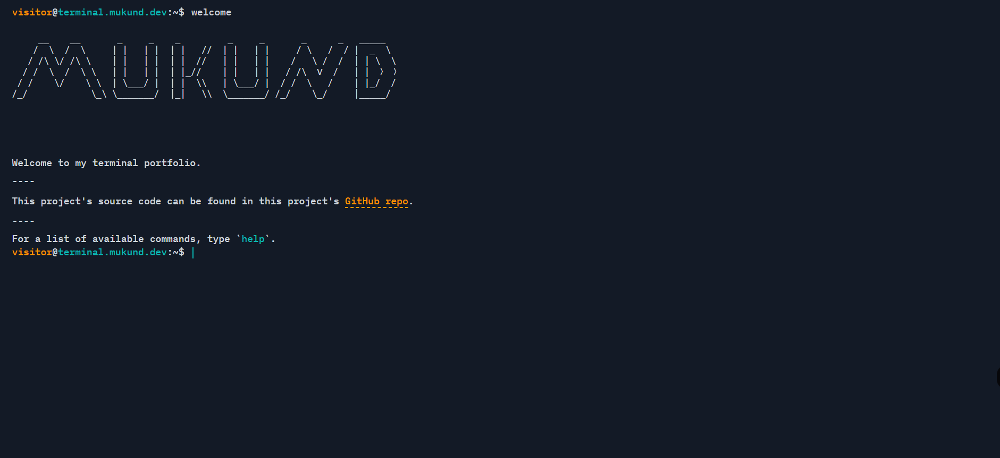
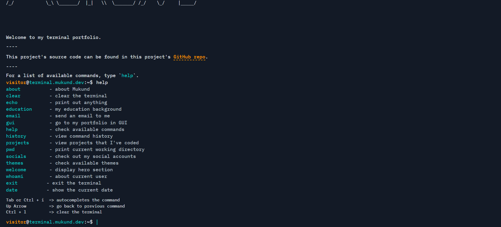

---

# 💻 Terminal Portfolio – A CLI-Inspired Interactive Dev Portfolio


## 📸 Preview

### 🖼️ Hero Section (ASCII Art)




### 💡 Commands & CLI Interaction




🧠 A fully interactive, terminal-style portfolio built with **React**, **TypeScript**, and **styled-components**, mimicking a real shell interface. Supports typed commands, tab-completion, theme switching, project navigation, and keyboard-friendly UX — all designed to highlight developer personality and skills in a unique way.

---

## 📖 Overview

**Terminal Portfolio** is not just a portfolio — it's an experience. Inspired by real Unix-style terminals, this project emulates a CLI environment in the browser. Users can type commands like `whoami`, `projects`, `email`, `themes`, and more — with intelligent autocompletion and keyboard-first navigation.

It serves as a personalized showcase of skills, projects, education, and socials — but with a nostalgic, developer-centric twist.

---

## 🌟 Features

### 🧠 Intelligent Command Parser

Execute custom commands such as `whoami`, `socials`, `projects`, `themes set`, `email`, and even simulate terminal behaviors like `clear`, `pwd`, `history`, and `exit`.

### 🔤 Tab Completion + Command Hints

Mimics real shell tab-autocomplete behavior. Press `Tab` to cycle through suggestions and get hints when typing incorrect or incomplete commands.

### 🎨 Dynamic Theming

Switch between built-in themes (like `dark`, `ubuntu`, `espresso`, `green-goblin`) using CLI commands:

```bash
themes set ubuntu
```

### 📁 Modular Command Architecture

Each command is a self-contained, styled React component. New commands can be added easily by following the modular pattern.

### 🧪 Unit + Integration Testing

Robust test coverage with **Vitest** + **Testing Library** covering rendering, keyboard input, redirection, and command output logic.

### 📦 Local Storage Persistence

Theme preferences persist across reloads using browser localStorage.

### 🖱️ Keyboard-First UX

Type, tab, and hit `Enter` — no mouse needed. Optimized for fast interaction using just the keyboard.


### 🔡 ASCII Hero Header

The hero section at the top features **custom-made ASCII art**, spelling out the developer's name using only terminal-friendly characters.

> 🎨 This was hand-crafted to reflect a nostalgic command-line vibe — a nod to old-school terminals and hacker culture. It took genuine patience and a touch of creativity to align every character manually.

This ASCII banner sets the tone for a personal and geeky terminal experience.


---

## 🚀 Live Project

🔗 [Visit Terminal Portfolio →](https://terminal-portfolio-git-main-mukund-thakurs-projects.vercel.app/)

---

## 🛠️ Tech Stack

### ⚛️ Frontend

* **React + TypeScript**
* **Vite** for blazing-fast dev builds
* **styled-components** for dynamic styling
* **React Context API** for theme state management

### 🔧 Tooling & Testing

* **Vitest** for unit and integration testing
* **Testing Library** for accessible test writing
* **Prettier** + **ESLint** for code linting and formatting
* **Husky** for Git pre-commit hooks

---

## 🧠 Architecture & Concepts Used

| Concept              | Description                                                     |
| -------------------- | --------------------------------------------------------------- |
| `Command Parser`     | Handles user input and dispatches to correct command components |
| `Autocomplete`       | Custom `Tab` cycle logic with real-time feedback                |
| `Dynamic Themes`     | Styled-components theme switching via CLI                       |
| `Command History`    | Remembers past commands and renders history in output           |
| `Keyboard Hooks`     | All interaction done via keyboard input                         |
| `Reusable Styled UI` | Each output is a styled terminal component                      |


---

## 🏗️ Local Setup

### ⚙️ Prerequisites

* Node.js ≥ 18
* npm, pnpm, or yarn

### 🔧 Installation

```bash
git clone https://github.com/Mukund934/terminal-portfolio.git
cd terminal-portfolio
npm install
```

### ▶️ Start Dev Server

```bash
npm run dev
```

Visit `http://localhost:5173` to explore.

---

## 🧑‍💻 What I Learned

✅ Implementing a command-based UI in React

✅ Building a CLI parser and autocompletion logic

✅ Managing themes with Context + localStorage

✅ Writing unit/integration tests with Vitest

✅ Building for accessibility and keyboard-first navigation

✅ Creating scalable component architecture

✅ Using styled-components for theming and styling

---

## 📦 Deployment

Deployed via **Vercel** for instant previews, production-ready builds, and global CDN.


---

## 🤝 Contributing

Found a bug or have a feature request?
**Fork → Code → Commit → PR 🚀** — Contributions are welcome!

---

## 📜 License

Licensed under the **MIT License**.
See the [LICENSE](./LICENSE) file for more info.

---

## 📬 Contact

👨‍💻 Created by [Mukund Thakur](https://github.com/Mukund934)

📩 Email: `mukund.th04@gmail.com`

🔗 GitHub: [Mukund934](https://github.com/Mukund934)


